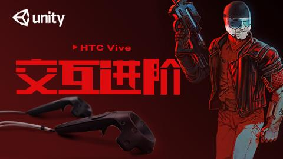

#VR 开发资源汇总(总结了：精选视频，网站教程，精选博客，各平台搭建，VR报告单，VR知识论文)
###Hololens 开发群：561889616
###微信公众号：VRAR开发者乐园

***
##精选视频教程
- [独立开发者的VR游戏开发全过程](http://www.taikr.com/course/447)

- [VR小游戏 怪物塔防](http://www.taikr.com/course/379)
- [VR小游戏 找怪物](http://www.taikr.com/course/376)
- [VR小游戏 捉迷藏](http://www.taikr.com/course/377)
- [FPS VR小游戏](http://www.taikr.com/course/413)
- [HTC Vive 交互进阶](http://www.taikr.com/course/435)

- [HTC Vive 交互基础](http://www.taikr.com/course/432)

***

##各平台搭建
- [VR系列教程 －－各平台开发环境搭建](http://toutiao.com/i6330030103044555266/)
- [HTC Vive 开发环境搭建](http://www.360doc.com/content/16/0712/10/10408243_574901317.shtml)
- [Google CardBoard开发环境搭建1](http://blog.csdn.net/wuyt2008/article/details/50236211)
- [Google CardBoard开发环境搭建2](http://blog.csdn.net/sunmc1204953974/article/details/50402331)
- [Oculus 开发环境配置](http://blog.csdn.net/zhangyulin311/article/details/51320429)
- [OculusRift DK2详细使用教程](http://www.9miao.com/thread-73811-1-1.html)
- [Gear VR 详官方开发环境搭建](http://www.vrzy.com/vr/6715.html)
- [Gear VR 开发环境搭建](http://blog.csdn.net/u014635337/article/details/51815283)
- [Web VR 开发教程](http://toutiao.com/i6332426777272517122/)
- [暴风魔镜开发环境搭建](https://pan.baidu.com/s/1pL923k3)（提取码：4wat）

##网站教程
- [泰课在线](http://www.taikr.com/course/explore/VR?filter%5Btype%5D=all&filter%5Bprice%5D=all&filter%5BcurrentLevelId%5D=all&orderBy=latest)－－国内专业的Unity3D以及VRAR专业视频学习平台,上千门实时更新课程,供学员在线观看,为国内开发者提供最新、最全、最快的视频学习教程
- [游戏蛮牛](http://edu.manew.com/course/explore/VR?filter%5Btype%5D=all&filter%5Bprice%5D=all&filter%5BcurrentLevelId%5D=all&orderBy=latest)－－游戏蛮牛旗下,国内最大的Unity3D专业视频学习平台,为国内开发者提供最新、最全、最快的视频学习教程
- [我赢职场](http://www.wyzc.com/Course/Course/exploreAction/category/7964)
***
##VR 基础之unity开发网站
- [慕课网](http://www.imooc.com/)－－慕课网(IMOOC)是国内最大的IT技能学习平台
- [麦子学院](http://www.maiziedu.com/)－－麦子学院专注IT职业在线教育,提供android开发、ios开发、coocs2d-x、Unity3D、游戏原画、物联网、产品经理、嵌入式、php等一系列线上IT培训服务,推出在线教育智能化...
- [极客学院](http://www.jikexueyuan.com/)－－极客学院作为中国最大IT职业在线教育平台,拥有海量高清IT职业课程
- [腾讯课堂](https://ke.qq.com/)－－腾讯推出的专业在线教育平台
- [百度传课](http://www.chuanke.com/)－－百度传课,中国最大的网络课程在线分享平台
- [网易云课程](http://study.163.com/category/mobile-game?utm_source=baidu&utm_medium=cpc&utm_campaign=affiliate&utm_term=PZPC19869&utm_content=SEM)
- [我学院](http://www.woxueyuan.com/)－－我学院是专注于VR开发游戏开发游戏设计的教程学习平台,我学院woxueyuan.com为您提供最新最实用的免费视频教程,免费课程涉及3d动漫教程,ps教程,3dmax教程,maya视频教程...
- [菜鸟在线](http://www.newbieol.com/)－－菜鸟在线—中国移动互联网职业技能培训领导品牌,专注提供Unity3d、HTML5、3dmax、游戏美术、UI设计、游戏开发等教程资源。名师授课、在线学习、就业率高,值得信赖!
- [宅客学院](http://www.zker.com.cn/)－－宅客学院是国内最专业的IT在线教育平台,拥有200多门IT培训课程,超过5000学时
- [游客学院](http://www.youkexueyuan.com/)－－国内最专业的在线教育平台,内容均按商业标准制作,全网首创游戏策划系列教程。独立开发不再是梦!
- [直线网](http://www.linecg.com/)－－直线网开创CG艺术学习的新模式,以推动中国CG艺术发展为宗旨,致力于成为全球规模最大、最专业、最具权威性的CG艺术在线学习和分享平台!

##VR 精选博客
- [zhangyulin311](http://blog.csdn.net/zhangyulin311/article/category/6214491)--VR 入门系列教程
- [VR 知识库](http://lib.csdn.net/base/vr?page=2&type=1#md)
- [VR开发，虚拟现实开发优化总结](http://blog.csdn.net/column/details/vroccart.html)
- [走进VR的世界](http://blog.csdn.net/column/details/virtualreality.html)
- [finish_dream](http://my.csdn.net/finish_dream)
- [zhang273162308](http://www.manew.com/home.php?mod=space&uid=3579&do=thread&view=me&from=space)
- [酒窝杀手Timxu](http://my.csdn.net/qq_15309121)--专注HTC VIVE
- [红尘不到](http://my.csdn.net/wuyt2008)
- [MingChaoSun](http://my.csdn.net/sunmc1204953974)
- [ajaxian](http://my.csdn.net/ejinxian)

***
##CardBoard 开发文章
- [Cardboard虚拟现实开发初步（一）](http://blog.csdn.net/sunmc1204953974/article/details/47187039)
- [Cardboard虚拟现实开发初步（二）](http://blog.csdn.net/sunmc1204953974/article/details/47189057)
- [ Cardboard虚拟现实开发初步（三）](http://blog.csdn.net/sunmc1204953974/article/details/47191517)
- [Cardboard虚拟现实开发初步（四）](http://blog.csdn.net/sunmc1204953974/article/details/50385206)
- [unity+Cardboard SDK VR开发Cardboard Unity SDK讲解](http://blog.csdn.net/liang_704959721/article/details/51367136)
- [如何开发一个最简单的Cardboard虚拟现实应用（一）](http://www.cnblogs.com/donghua/p/4993473.html)
- [Cardboard虚拟现实开发技巧(一)之放置一个固定在视野中的物体](http://blog.csdn.net/sunmc1204953974/article/details/50402331)
- [ Cardboard虚拟现实开发技巧(二)之保持手机常亮](http://blog.csdn.net/sunmc1204953974/article/details/50423667)

***
##Oculus 开发文章
- [OculusRift DK2详细使用教程](http://www.9miao.com/thread-73811-1-1.html)
- [用Unity开发OculusRift体验演示教程](http://blog.sina.com.cn/s/blog_697b1b8c0102v0mg.html)
- [Oculus官方推荐实践教程（中文版)](http://download.csdn.net/detail/cy23520/9432750)
- [使用Oculus移动端SDK](http://blog.csdn.net/liulong1567/article/details/51164576)

***
##HTC Vive 开发教程
- [开发HTC Vive应用的重要资源](http://bbs.csdn.net/topics/391871181)
- [基于HTC Vive的VR游戏开发入门](http://edu.csdn.net/course/detail/2629)
- [HTC Vive的Lighthouse工作原理](http://blog.csdn.net/liulong1567/article/details/50833265)
- [HTC Vive视频搭建教程](http://www.pcpop.com/view/2/2750/2750384.shtml?r=16141006)
- [HTC Vive虚拟现实眼镜使用教程](http://www.imdaike.com/zh-CN/displaynews.html?newsID=397798)
- [如何安装 HTC VIVE](http://www.chinaz.com/vr/2016/0509/529576.shtml)
- [HTC vive使用指南](http://wenku.baidu.com/link?url=7XDm7__6vEis123YJ8NqakntxKm3CHyINzOqi67eo8TWCMbNqiS6s1PU0_E53JyEr_EJMpt8S75yihDrc5auAAPtsKxUi4QUHrEgYTY0zqu)
- [HTC Vive虚拟现实眼镜使用教程图解](http://www.hao5191.cn/news/wangluoxueyuan/20160417/218425.html)

***
##Web VR 开发教程
- [ VR开发 入门 使用Three.js 开发的WebVR demo](http://blog.csdn.net/ritterliu/article/details/51386980)
- [10分钟教你完成一个虚拟现实WEB体验](http://mt.sohu.com/20151026/n424132314.shtml)
- [一个简单的webVR体验 experience](http://www.open-open.com/lib/view/open1449986253359.html)
- [WebVR如此近 - three.js的WebVR示例程序解析](https://zhuanlan.zhihu.com/p/21556998)

***
## VR 报告单
- [【VR+直播】“VR+直播”是生态布局的最重要拼图](https://pan.baidu.com/s/1gf7GU1X)(提起码：3afr)
- [VR产品大全整理](https://pan.baidu.com/s/1boQ5Dfx)(提取码：w6xm)
- [腾讯高级工程师泣血制作的VR技术报告](https://pan.baidu.com/s/1mhOR3rM)(提取码：38v2)
- [一篇文章理解虚拟现实技术](https://pan.baidu.com/s/1hr8K9VY)
- [VR行业十年完整分析报告](https://pan.baidu.com/s/1c1XVnl2)(提取码：j1ud)
- [高盛行业研究报告《VR与AR：解读下一个通用计算平台](https://pan.baidu.com/s/1gf2XjJP)(提取码：aqk4)
- [VR圈深度图谱报告，所有融资和布局VR的公司都在这里了！](https://pan.baidu.com/s/1jIe48aM)(提取码：9d5e)
- [VR在工程中的应用研究报告-苏兴华0322](https://pan.baidu.com/s/1qXA6ja0)(提取码：agcz)
- [VR行业十年完整分析报告(1)](https://pan.baidu.com/s/1eRKZWEe)(提取码：gqbg)
- [VR行业现状研究报告出炉，182页PPT帮你了解虚拟现实目前状况](https://pan.baidu.com/s/1mifMysK)（提取码：rip3）
- [德银VR报告中文完整版来了！2万字让你了解关于VR的一切](https://pan.baidu.com/s/1kVPPCH5)（提取码：e5fq）
- [澄泓研究_VR内容产业现状和发展趋势报告](https://pan.baidu.com/s/1o8uB2Oy)（提取码：dd84）
- [阿里投了8个亿的AR公司Magic Leap，曾发过一份逆天报告](https://pan.baidu.com/s/1mik6gqO)（提取码：b3sd）
- [中国VR_AR产业品牌发展报告全文，3万多字覆盖该领域的方方面面](https://pan.baidu.com/s/1pK9mpcB)（提取码：urve）
- [36Kr：2016年虚拟现实行业研究报告（应用篇）](https://pan.baidu.com/s/1dF0t2pz)（提取码：7csa）
- [关于VR的发展历史和未来，这6000字长文梳理得够清楚了！](https://pan.baidu.com/s/1qY4aN5E)(提取码：p2nb)
- [电影和文学里的VR文化史，虚拟现实从业者必读](https://pan.baidu.com/s/1hsyR0Cs)(提取码：u7am)

***
##VR 论文

- [虚拟人行走运动算法分析与实现_张金钊](https://pan.baidu.com/s/1o8hep7O)(提取码：4gp4)
- [基于虚拟现实技术的漫游系统_金永涛](https://pan.baidu.com/s/1dF4xplB)(提取码：eij6)
- [基于虚拟现实技术的现代教育探索_王志坚](https://pan.baidu.com/s/1o8D8pjc)(提取码：5c9e)
- [虚拟实在与自然实在的本体论对等性](https://pan.baidu.com/s/1c2Hq56g)(提取码：dx9x)
- [一种基于Web的虚拟现实VR设备展示技术的实现_叶琳](https://pan.baidu.com/s/1mhQTwa0)(提取码：b9y6)
- [虚拟手机交互系统的研究_徐东风](https://pan.baidu.com/s/1sl6G9NB)(提取码：dymw)
- [符号学在VR手势交互设计中的应用研究_尹超](https://pan.baidu.com/s/1hs6ta7M)(提取码：am6a)
- [基于VR的虚拟视景系统关键技术研究_钟啸](https://pan.baidu.com/s/1eRKZXHC)(提取码：b2wa)
- [从专利角度解析VR与AR_邵永德](https://pan.baidu.com/s/1hrCiyvM)(提取码：7a4y)
- [跟着VR去火星_杨洋](https://pan.baidu.com/s/1jIbMKWe)(提取码：9w87)
- [基于Internet的虚拟现实交互技术_杨俊超](https://pan.baidu.com/s/1dF7KXiT)(提取码：k2mn)
- [基于Agent方法体系的VR仿真研究_李彤](https://pan.baidu.com/s/1kVLfVRD)(提取码：2enj)
- [基于虚拟现实的WEB智能教学系统研究_张晓清](https://pan.baidu.com/s/1nuQlwqH)(提取码：9fz8)
- [虚拟现实系统中的可见光成像仿真_王滨](https://pan.baidu.com/s/1hrXhe6o)(提取码：af93)
- [浅析VR在房地产领域的应用前景_刘成](https://pan.baidu.com/s/1o7GFSmA)(提取码：yhgs)
- [基于VR的建筑物仿真与交互技术_张小萍](https://pan.baidu.com/s/1hr4GOuw)(提取码：zsfh)
- [基于VR技术的虚拟教学应用研究_黄鑫](https://pan.baidu.com/s/1pLNFCuR)(提取码：nc8p)

***

#不断更新中...

